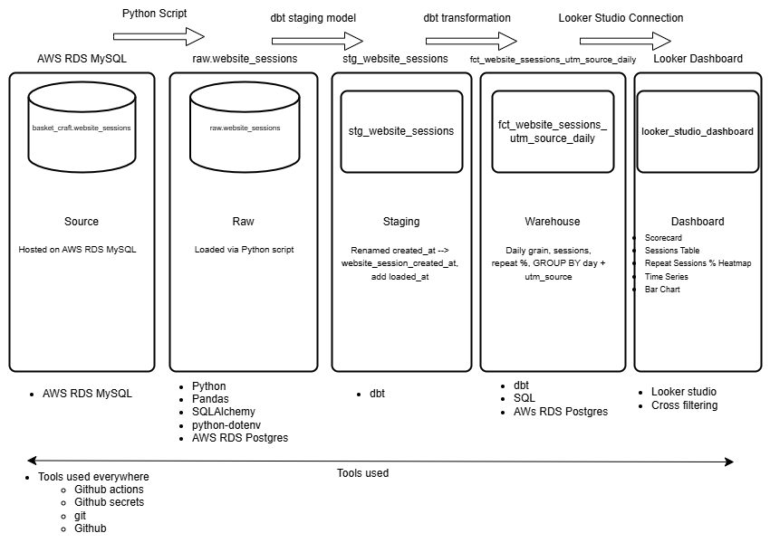

# Basket Craft – Website Sessions and Marketing Channel Performance

This repository contains a full data pipeline that analyzes website session data for Basket Craft. It extracts December 2023 sessions from a MySQL source, loads them into a Postgres raw schema, transforms the data using dbt into staging and warehouse models, and visualizes the results through an interactive Looker Studio dashboard. The project integrates lessons from the class and applies them to real-world practices in data engineering, analytics engineering, and business intelligence.

## 📌 Data Pipeline Diagram

